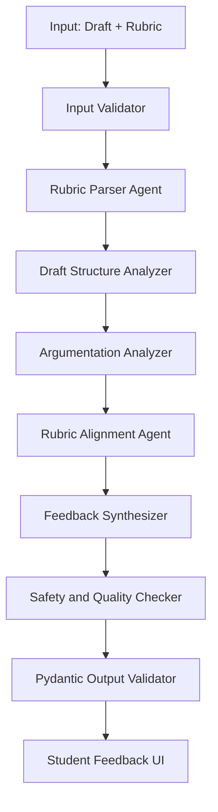

# Agentic AI Workflow

## Purpose

The AI workflow should demonstrate technical depth beyond a simple chatbot. The system should process a draft and rubric through multiple specialized steps, validate outputs, and return learner-centered formative feedback.

## Workflow Summary



## Shared State

A LangGraph-style state object could include:

```python
from typing import TypedDict, List, Optional, Dict, Any

class FeedbackState(TypedDict):
    session_id: str
    assignment_title: Optional[str]
    draft_text: str
    rubric_text: str
    parsed_rubric: List[Dict[str, Any]]
    structure_analysis: Dict[str, Any]
    argumentation_analysis: Dict[str, Any]
    rubric_alignment: List[Dict[str, Any]]
    final_feedback: Dict[str, Any]
    errors: List[str]
    warnings: List[str]
```

## Node 1: Input Validator

### Purpose

Checks whether the draft and rubric are usable.

### Checks

- draft exists,
- rubric exists,
- draft has minimum length,
- draft does not exceed V1 length limit,
- file type is supported,
- text extraction succeeded.

### Possible Outputs

- continue,
- request clearer rubric,
- return short-draft fallback,
- reject unsupported file type.

## Node 2: Rubric Parser Agent

### Purpose

Convert rubric text into structured criteria.

### Input

Raw rubric text.

### Output

```json
{
  "criteria": [
    {
      "name": "Argument Quality",
      "description": "Evaluates clarity of claim, reasoning, and support",
      "weight": null,
      "performance_levels": []
    }
  ]
}
```

### Prompt Intent

Ask the model to identify rubric criteria only from the provided rubric. It must not invent criteria.

### Failure Handling

If rubric is too vague, return a message asking the student to provide a clearer rubric or assignment instructions.

## Node 3: Draft Structure Analyzer

### Purpose

Analyze organization and flow.

### Looks For

- thesis or central claim,
- introduction,
- paragraph organization,
- transitions,
- conclusion,
- section coherence,
- missing context.

### Output

```json
{
  "structure_summary": "string",
  "strengths": ["string"],
  "issues": ["string"],
  "evidence_from_draft": ["string"]
}
```

## Node 4: Argumentation Analyzer

### Purpose

Analyze claims, evidence, reasoning, and logic.

### Looks For

- main claim,
- supporting evidence,
- unsupported statements,
- counterarguments,
- logical gaps,
- specificity,
- relevance to assignment.

### Output

```json
{
  "argument_summary": "string",
  "strong_claims": ["string"],
  "unsupported_claims": ["string"],
  "reasoning_gaps": ["string"],
  "suggestions": ["string"]
}
```

## Node 5: Rubric Alignment Agent

### Purpose

Compare draft against each rubric criterion.

### Input

- parsed rubric,
- draft text,
- structure analysis,
- argumentation analysis.

### Output

```json
{
  "rubric_feedback": [
    {
      "criterion": "Argument Quality",
      "status": "partially_meets",
      "evidence_from_draft": "The draft states a clear recommendation but does not support it with data.",
      "suggestion": "Add evidence from the case or course material to support the recommendation."
    }
  ]
}
```

### Status Values

Use only:

- `meets`
- `partially_meets`
- `needs_work`
- `not_enough_evidence`

## Node 6: Feedback Synthesizer

### Purpose

Turn internal analysis into student-facing feedback.

### Output Fields

- overall summary,
- readiness level,
- strengths,
- top priorities,
- rubric feedback,
- revision checklist.

### Tone Rules

Feedback should be:

- constructive,
- specific,
- encouraging,
- revision-oriented,
- not punitive,
- not framed as an official grade.

## Node 7: Safety and Quality Checker

### Purpose

Check final feedback before display.

### Checks

- Does it assign a grade?
- Does it claim to replace instructor review?
- Does it fabricate rubric criteria?
- Is feedback too harsh?
- Are suggestions actionable?
- Are unsupported claims marked uncertain?
- Does each rubric-level comment include evidence?

### Possible Actions

- approve,
- revise tone,
- remove grading language,
- retry feedback generation,
- return fallback.

## Node 8: Pydantic Output Validator

### Purpose

Validate final JSON response.

## Suggested Pydantic Schema

```python
from enum import Enum
from typing import List, Optional
from pydantic import BaseModel, Field

class ReadinessLevel(str, Enum):
    early = "early"
    developing = "developing"
    strong = "strong"

class CriterionStatus(str, Enum):
    meets = "meets"
    partially_meets = "partially_meets"
    needs_work = "needs_work"
    not_enough_evidence = "not_enough_evidence"

class RubricFeedbackItem(BaseModel):
    criterion: str
    status: CriterionStatus
    evidence_from_draft: str
    suggestion: str

class FeedbackResponse(BaseModel):
    overall_summary: str
    readiness_level: ReadinessLevel
    strengths: List[str] = Field(min_length=1, max_length=5)
    top_priorities: List[str] = Field(min_length=1, max_length=5)
    rubric_feedback: List[RubricFeedbackItem]
    revision_checklist: List[str] = Field(min_length=1, max_length=8)
    disclaimer: str
```

## Fallback Logic

### Missing Rubric

Return:

> I need a rubric or assignment criteria to provide rubric-aligned feedback. Please paste the rubric or assignment instructions.

### Very Short Draft

Return:

> This draft is too short for full rubric-aligned feedback. I can still provide early guidance, but the feedback may be limited.

### Model Failure

Return:

> I could not generate reliable feedback for this submission. Please try again or simplify the draft/rubric input.

### Validation Failure

Retry once with stricter JSON instructions. If it fails again, return a safe fallback.

## Example System Instruction

```text
You are a formative writing feedback assistant for students. You do not grade assignments. You do not replace instructor feedback. You provide constructive, rubric-aligned revision guidance based only on the provided draft and rubric. If evidence is missing, say not enough evidence instead of guessing.
```

## Example Rubric Parser Prompt

```text
Parse the provided rubric into structured criteria. Use only the rubric text. Do not invent criteria. Return JSON with criterion name, description, weight if present, and performance levels if present.
```

## Example Rubric Alignment Prompt

```text
Compare the student draft to each rubric criterion. For each criterion, identify whether the draft meets, partially meets, needs work, or lacks enough evidence. Include a short evidence quote or paraphrase from the draft and one actionable revision suggestion.
```

## Example Feedback Synthesizer Prompt

```text
Create student-facing formative feedback from the structured analyses. Keep the tone constructive and specific. Do not assign a grade. Focus on revision priorities and rubric alignment. Return valid JSON matching the provided schema.
```

## Quality Principle

The agent should not sound impressive at the expense of being useful. It should help the student decide what to revise next.
