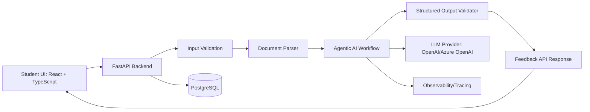

# Architecture

## System Overview

The MVP is a student-facing web application that accepts a written assignment draft and rubric, runs a multi-step AI analysis workflow, and returns structured formative feedback.

The architecture should demonstrate custom software and agentic AI depth rather than a single generic chatbot.

## High-Level Architecture

## Main Components

### 1. Frontend

Recommended stack:

- React
- TypeScript
- Tailwind CSS or simple component library

Responsibilities:

- collect draft text or file upload,
- collect rubric text,
- display loading state,
- show feedback result cards,
- collect usefulness rating,
- show disclaimer.

Suggested pages/components:

- `DraftSubmissionPage`
- `RubricInputPanel`
- `FeedbackResultsPage`
- `RubricFeedbackCard`
- `RevisionChecklist`
- `UsefulnessRating`

## 2. Backend API

Recommended stack:

- Python
- FastAPI
- Pydantic

Responsibilities:

- expose API endpoints,
- validate inputs,
- parse files,
- invoke agent workflow,
- validate AI output,
- write usage events,
- return JSON to frontend.

Suggested endpoints:

| Method | Endpoint | Purpose |
|---|---|---|
| `POST` | `/api/feedback/generate` | Submit draft and rubric; generate feedback |
| `POST` | `/api/events` | Record frontend usage events |
| `POST` | `/api/feedback/rating` | Save usefulness rating |
| `GET` | `/api/health` | Health check |

## 3. Document Parsing

V1 supported inputs:

- pasted plain text,
- `.docx`.

Optional if time allows:

- text-based PDF through PyMuPDF.

Avoid in V1:

- scanned PDFs,
- OCR,
- slides,
- images,
- spreadsheets.

## 4. Agentic AI Layer

Recommended stack:

- OpenAI API or Azure OpenAI,
- LangGraph or equivalent orchestration,
- structured outputs.

The agentic layer should run a pipeline with separate responsibilities:

1. rubric parsing,
2. draft structure analysis,
3. argumentation analysis,
4. rubric alignment,
5. feedback synthesis,
6. safety/quality check.

This is intentionally more advanced than a custom GPT because the system has:

- state,
- explicit workflow stages,
- structured schemas,
- validation,
- fallback behavior,
- event logging,
- quality checks.

## 5. Storage

Recommended:

- PostgreSQL

Tables:

- `feedback_sessions`
- `rubrics`
- `rubric_criteria`
- `feedback_results`
- `usage_events`
- `feedback_ratings`

See `data_model.md` for schema details.

## 6. Observability

Track:

- request ID,
- model call latency,
- total request latency,
- validation failures,
- retries,
- model used,
- error type,
- user rating.

Optional tooling:

- LangSmith,
- OpenTelemetry,
- backend logs.

## Data Flow

1. Student submits draft and rubric through frontend.
2. Frontend sends request to FastAPI.
3. Backend validates input.
4. Backend parses document if uploaded.
5. Backend creates a `feedback_session`.
6. Agent workflow parses rubric.
7. Agent workflow analyzes draft structure.
8. Agent workflow analyzes argumentation.
9. Agent workflow compares draft to rubric.
10. Feedback synthesizer creates student-facing response.
11. Safety/quality checker verifies tone and groundedness.
12. Pydantic validates final output schema.
13. Backend stores feedback metadata and usage events.
14. Frontend displays feedback cards and checklist.
15. Student rates usefulness.

## Key Design Decisions

### Why Not a Single Chatbot?

A single chatbot response may produce generic feedback. This MVP needs rubric parsing, draft evidence extraction, structured scoring categories, validation, and a controlled student-facing output.

### Why LangGraph?

LangGraph or graph-style orchestration is useful because each stage has a different responsibility and the workflow may need conditional routing.

Example:

- if rubric parsing fails, ask for clearer rubric;
- if draft is too short, return limited feedback;
- if output validation fails, retry with stricter instructions;
- if evidence is insufficient, mark criterion as uncertain.

### Why Pydantic?

Pydantic ensures that the LLM returns predictable, structured output. This matters because frontend rendering and student trust depend on consistent response objects.

### Why PostgreSQL?

PostgreSQL is reliable for structured metadata, sessions, events, and feedback ratings. It can later support draft versioning for the Scenario D extension.

### Why Avoid Full Draft Versioning in V1?

Multi-draft comparison is valuable but adds complexity. V1 should focus on single-draft feedback and design the schema so versioning can be added later.

## Deployment Assumption

For the take-home submission, mention that deployment would depend on Gies-approved infrastructure.

A realistic prototype could use:

- Dockerized FastAPI backend,
- React frontend,
- PostgreSQL database,
- university-approved cloud or internal environment.

## Security and Privacy Considerations

- Avoid storing full draft text unless required.
- Use session IDs rather than unnecessary student identifiers.
- Add access controls if authenticated users are introduced.
- Log minimal necessary data.
- Do not expose raw model prompts or private draft text in analytics.
- Add retention policy for drafts and generated feedback.
